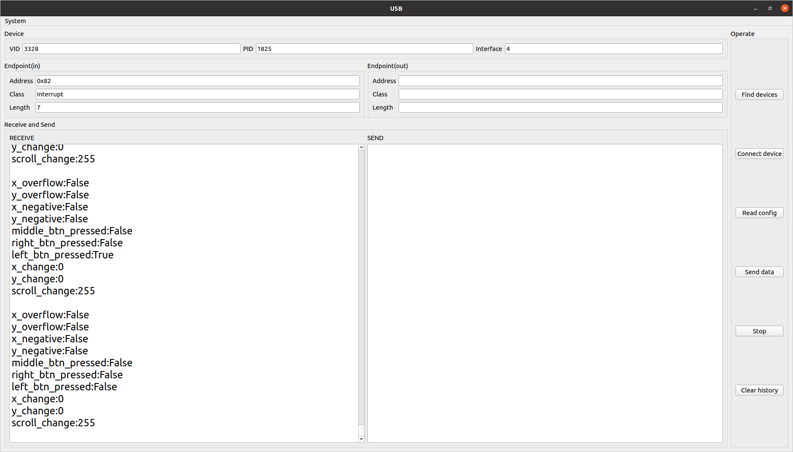

# KeyboardUC

## BEFORE IT

```bash
sudo nautilus 50-myusbkeyboard.rules /etc/udev/rules.d
# This will pop up two windows, source and destination. 
# Copy the file you want to move in the source window, then paste it in the destination window.
# Once successful, close them，done
```

```bash
sudo adduser <username> plugdev
```

## EXAMPLES

+ usb test:
  + 
