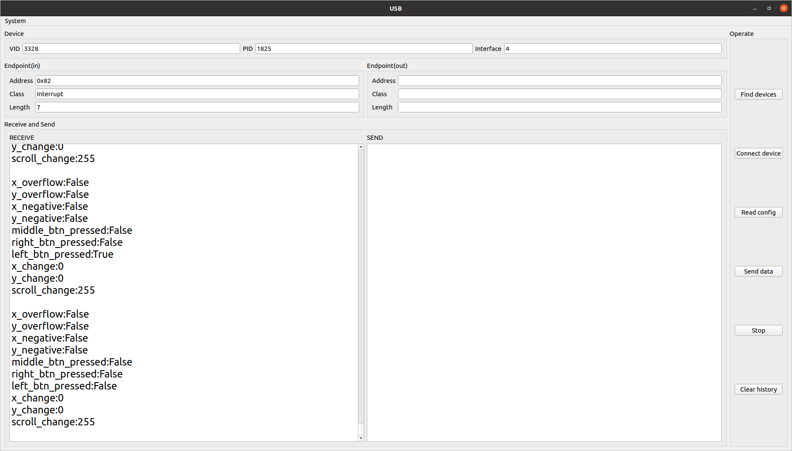
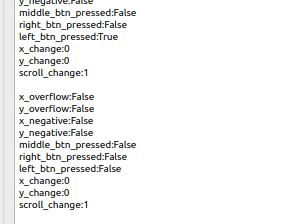
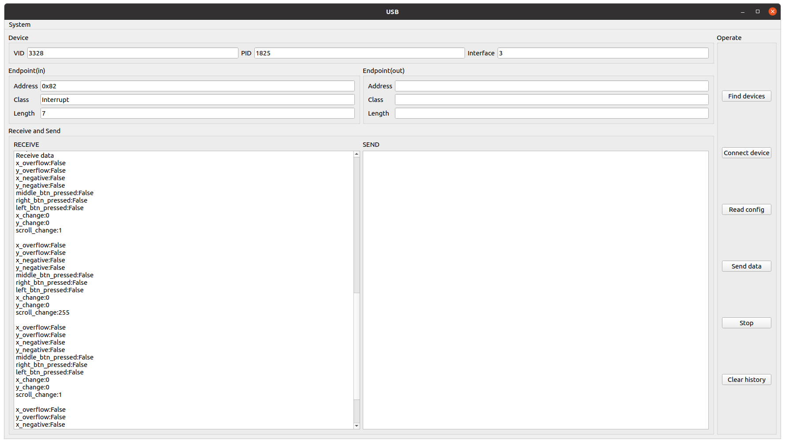
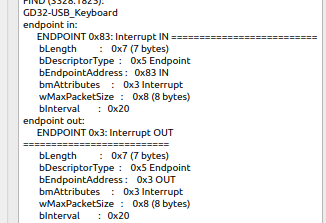

# KeyboardUC

## BEFORE IT

```bash
sudo nautilus 50-myusbkeyboard.rules /etc/udev/rules.d
# This will pop up two windows, source and destination. 
# Copy the file you want to move in the source window, then paste it in the destination window.
# Once successful, close them，done
```

```bash
sudo adduser <username> plugdev
```

## TESTS

+ usb test:
    + mouse test
        + test 
            + left button 
            + scroll 
    + keyboard test
        + interface 

## Bluetooth By Terminal

```bash
sudo bluetoothctl  # input password and press enter
menu gatt
#list-attributes 
select-attribute /org/bluez/hci0/dev_B0_D2_78_76_6E_21/service0054/char0055
2
write <HEX>
```

## I2C By CH341T USB-I2C

| function       | Data                               |
|----------------|------------------------------------|
| I2C init       | aa6000                             |
| Light          | aa4a4a74837202ff748173c2c07500     |
| Keyboardlayout | aa4a4a74857204000005748173c2c07500 |
